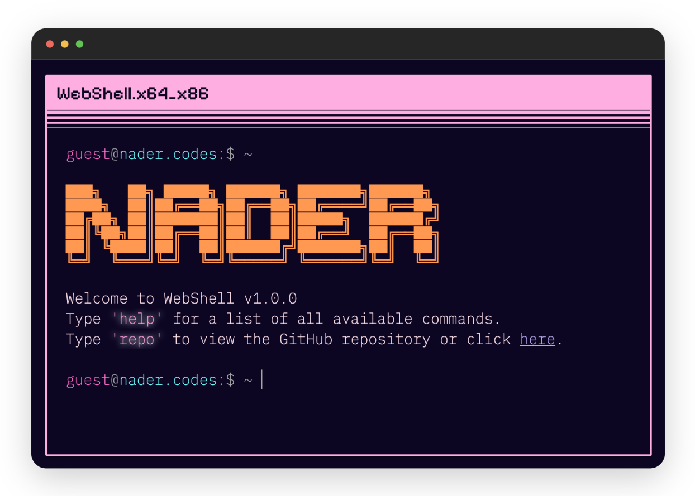

# [WebShell | Terminal Portfolio Website](https://terminal.nader.codes/)

> Forked from [https://github.com/nasan016/webshell](https://github.com/nasan016/webshell)




## Features
* **[Tab]** for auto completion.
* **[Esc]** to clear the input line.
* **[↑][↓]** to scroll through your command history.

## ???
<div align="center">
  
</div>
How did we get here?

## Configuration

Most of the configuration is done in the `config.json` file.

> Generate ascii [here](https://patorjk.com/software/taag/). ANSI Shadow is the current font family.

```json
{
  "ascii": [
    "███╗   ██╗ █████╗ ██████╗ ███████╗██████╗ ",
    "████╗  ██║██╔══██╗██╔══██╗██╔════╝██╔══██╗",
    "██╔██╗ ██║███████║██║  ██║█████╗  ██████╔╝",
    "██║╚██╗██║██╔══██║██║  ██║██╔══╝  ██╔══██╗",
    "██║ ╚████║██║  ██║██████╔╝███████╗██║  ██║",
    "╚═╝  ╚═══╝╚═╝  ╚═╝╚═════╝ ╚══════╝╚═╝  ╚═╝ "
  ],
  "repoLink": "https://github.com/dabit3/terminal-portfolio",
  "social": {
    "email": "dabit3@gmail.com",
    "github": "dabit3",
    "linkedin": "naderdabit"
  },
  "aboutGreeting": "Hi I'm Nader. I'm a full stack product engineer specializing in high impact developer marketing.",
  "projects": [
    [
      "React Native AI",
      "Full stack framework for building cross-platform mobile AI apps.",
      "https://github.com/dabit3/react-native-ai"
    ],
    [
      "React Native Elements",
      "Cross-Platform React Native UI Toolkit.",
      "https://github.com/react-native-elements/react-native-elements"
    ]
  ]
}
```

## Run the Project Locally:

Clone the repository
```shell
git clone https://github.com/nasan016/webshell.git
```
Go to the project directory
```shell
cd webshell
```
Install the dependencies
```shell
npm install
```
Start the server
```shell
npm run dev
```
